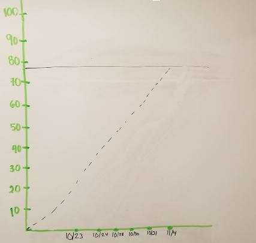
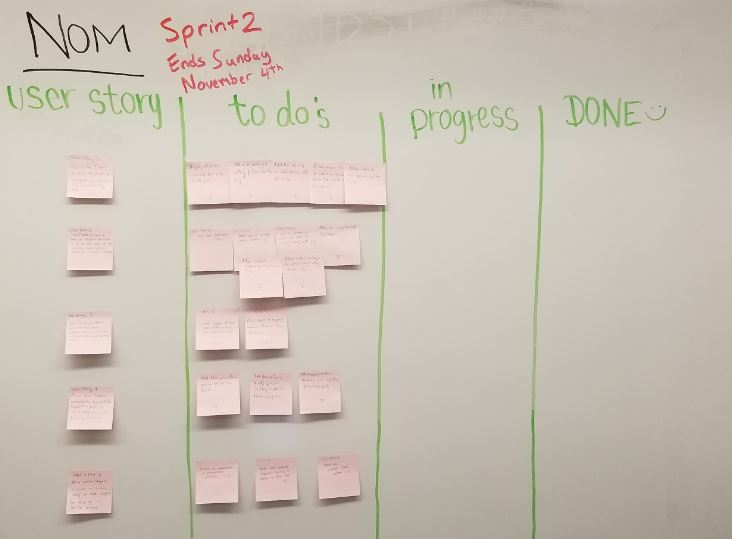

## ---- Sprint 2 Plan ----
**Product Name:** NOM Dining Hall Meal Exchange
**Team Name:** Nom Slugs
**Sprint Completion Date:** November 4, 2018        
**Revision Number:** 4
**Revision Date:** October 30, 2018

## ---- Goal ---- 
Sellers are able to list their dining hall guest passes at a specific price for buyers to view.

## ---- Task Listing ----
### User Story 1: As a seller, I want to list my passes on the site so other students can buy them from me.
	- Allow users to list passes to the site (5 hours)
	- Display all passes currently for sale on the site (4 hours) 
	- Add a average listed price (3 hours)
	- Allow sellers to remove passes from the site (3 hours)
	- Allow sellers to change price of their meals (3 hours)
**Total for User Story 1: 18 hours**
### User Story 2: As a seller, I want to have an account dashboard so I can keep track of my available guest passes and edit my information.
	- Allow user to change profile picture (6 hours)
	- Add user description (2 hours)
	- Allow user to input contact information (4 hours)
	- Add a location so others can know the closest dining hall (4 hours)
**Total for User Story 2: 16 hours**
### User Story 3: As a buyer, I want to see information about available passes so I can contact sellers and purchase them.
	- Allow buyers to view seller’s profile and see their picture/ location (6 hours)
	- Update account routing to ensure users see the information about the sellers account (5 hours)
**Total for User Story 3: 11 hours**
### User Story 4: As a user I want a navigation bar at the top of the page to easily navigate to other places on the site.
	- Add navigation bar at the top of the page (4 hours)
	- Make each button navigate user to a different part of the page (2 hours)
	- Add a pop up form to add passes including number of passes and price (6 hours)
**Total for User Story 4: 12 hours**
### User Story 5: As a seller/buyer, I want a clean, easy to use layout for buying or selling passes.
	- Make the website look better (5 hours)
	- Make sure website responds quickly to actions by the user (6 hours) 
	- Ensure the database is organized correctly (2 hours)
**Total for User Story 5: 13 hours**

**Total for All User Stories: 70**

## ----- TEAM ROLES -----
**Megan Wu:**       
	Product Owner, Developer

**Nicolle Ayon:**   
	Developer

**Eric Rong:**       
	Developer

**Steve Chan:**     
	Developer

**Kyler Beck:**     
	Scrum Master, Developer

## ---- Initial Task Assignment ----
**Megan Wu:**        
	User Story 4, Add passes pop up
**Nicolle Ayon:**    
	User Story 2, Account Dashboard
**Eric Rong:**        
	User Story 3, Show information about available passes    
**Steve Chan:**      
	User Story 3, Show information about available passes
**Kyler Beck:**      
	User Story 1, List passes on the site

## ---- INITIAL BURN UP CHART -----

## ---- INITIAL SCRUM BOARD -----

## ---- SCRUM Times ----
Sunday: 2:00-4:00
Tuesday: 6:30-9:00
Wednesday: 2-2:30 (TA)
