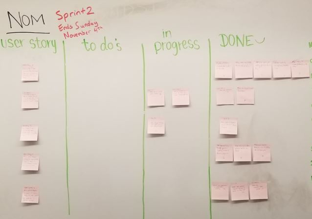
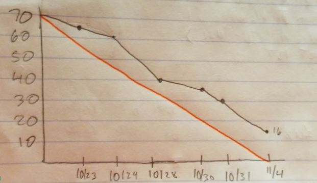

----- SPRINT 2 REPORT -----

Product Name: NOM Dining Hall Meal Exchange

Team Name: Nom Slugs

Sprint Completion Date: November 4th, 2018

----- ACTIONS TO STOP DOING -----

Stop commiting to master. Use branches instead.
Work on more accurate estimation of tasks. Tasks felt underestimated for the first part of the sprint, but at the end they felt a little more overestimated. As we grow more comfortable with the technologies, we should be able to more accurately estimate tasks.

----- ACTIONS TO START DOING -----

Communication in work meetings is important. During work meetings after scrum meetings its important for members to explain how they fixed issues in case it may help other members with their problems.
Use branches. Instead of all members working off master, use branches for additional features and keep master clean.

----- ACTIONS TO KEEP DOING -----

Meeting times are working. Members have been on time and scrum meetings have been productive. Work meetings have also been helpful allowing members to help each other with difficulties. 
Communication has been good. All members have been responsive in group chat.

----- WORK COMPLETED / NOT COMPLETED -----

We completed most of our tasks. There were a few related tasks that could not be completed without the completion of other tasks. Overall, we accomplished most of what e wanted for this sprint, and hopefully can complete the few tasks we missed in sprint 3.

Completed: User Story 1: As a seller, I want to list my passes on the site so other students can buy them from me.

Incomplete: User Story 2: As a seller, I want to have an account dashboard so I can keep track of my available guest passes and edit my information.
We accomplished most of this user story, however we ran into trouble with the profile picture and location. We are putting these tasks into the product backlog for completion in a future sprint.

Incomplete: User Story 3: As a buyer, I want to see information about available passes so I can contact sellers and purchase them.
One task of this user story involved displaying sellers profile picture and location, which were not completed from User Story 2. We put this task into the product backlog for future completion.

Complete: User Story 4: As a user I want a navigation bar at the top of the page to easily navigate to other places on the site.

Complete: User Story 5: As a seller/buyer, I want a clean, easy to use layout for buying or selling passes.

----- WORK COMPLETION RATE -----

Total User Stories Completed: ⅗

Total Hours Completed: 54/70

Total Days: 14 days, 6 scrum meetings

