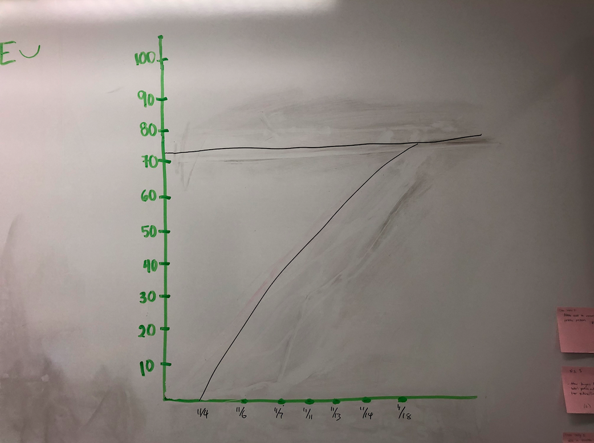
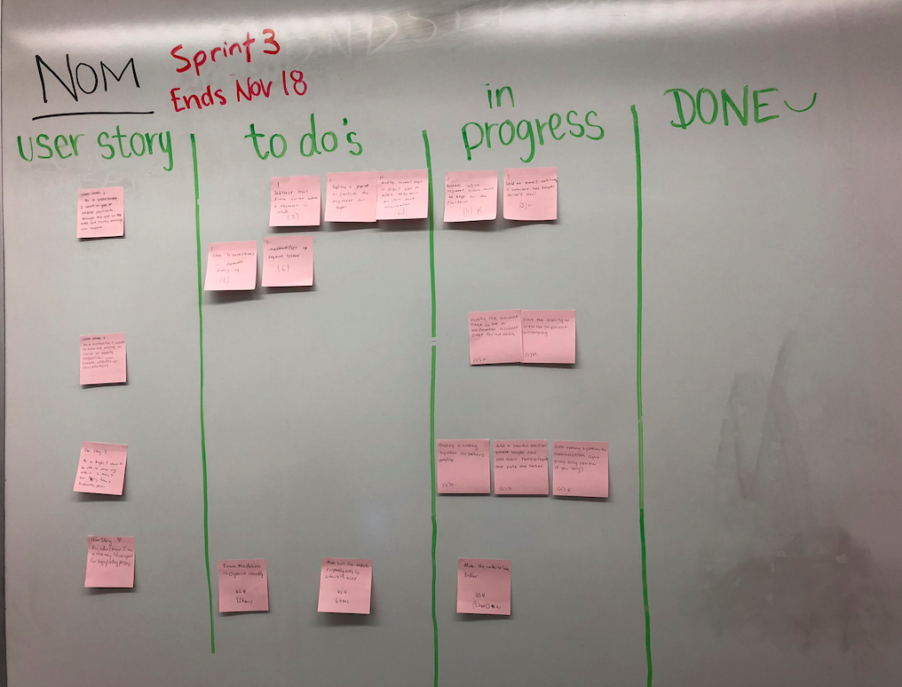

# ----- SPRINT 3 PLAN -----
**Product Name:** NOM Dining Hall Meal Exchange  
**Team Name:** Nom Slugs  
**Sprint Completion Date:** November 18, 2018  
**Revision Number:** 1  
**Revision Date:** November 4, 2018

## ----- GOAL -----
The buyer is able to buy a pass from the seller using the payment system integrated, 
while the seller is able to receive payment and is notified if somebody buys a meal from them.

## ----- TASK LISTING -----
### User Story 1: As a seller/buyer, I want to give or receive payments through the app so the meal and money exchange can happen.
  - Send an email notification if someone has bought seller’s meal. (3 hours)
  - Research which payment system would be best for the platform (4 hours)
  - Implement/set up payment system (6 hours)
  - Modify Account Page to direct user to where they will put their bank information in. (6 hours)
  - Display a pop-up to confirm the payment for buyer (6 hours)
  - Subtract meal from seller when a payment is made (3 hour)
  - Save transactions in a payment history log (6 hours)

**Total for User Story 1:** 34 hours

### User Story 2: As a moderator, I want to have the ability to cancel or modify payouts so I can handle disputes or cancellations.
  - Modify the account page to be a moderator account page for admins (5 hours)
  - Have the ability to view the payment history log (6 hours)

**Total for User Story 2:** 11 hours

### User Story 3: As a buyer, I want to be able to review my seller so I know I am buying from a trustworthy person.
  -  Display a rating system on seller’s profile (5 hours)
  - Add a review section where buyer can add their review (text) and rate the seller. (6 hours)
  - Link rating system to transaction (you may only review if you buy) (4 hours)

**Total for User Story 3:** 15 hours

### User Story 4: As a seller/buyer, I want a clean, easy to use layout for buying or selling passes.

 - Improve user experience by making the website look better (5 hours)
 - Make sure website responds quickly to actions by the user (6 hours) 
 - Ensure the database is organized correctly (2 hours)

 **Total for User Story 4:** 13 hours
 
 **TOTAL HOURS: 72**
 
## ----- TEAM ROLES -----
**Megan Wu:**       Product Owner, Developer  
**Nicolle Ayon:**   Scrum Master, Developer   
**Eric Rong:**      Developer  
**Steve Chan:**     Developer  
**Kyler Beck:**     Developer  

## --- INITIAL TASK ASSIGNMENT -----
**Megan Wu:**  
  User story 2: Modify the account page to be a moderator account page for admins  
  User story 2: Have the ability to view the payment history log  
**Nicolle Ayon:**  
  User story 1: Send an email notification if someone has bought seller’s meal.  
  User story 1: Improve user experience by making the website look better  
**Eric Rong:**  
  Link rating system to transaction (you may only review if you buy)  
**Steve Chan:**  
  User story 3: Display a rating system on seller’s profile  
  User story 3: Add a review section where buyer can add their review and rate the seller.  
**Kyler Beck:**  
  User story 1: Research which payment system would be best for the platform  

## --- INITIAL TASK ASSIGNMENT -----
  

## --- INITIAL SCRUM BOARD -----
    

## ----- SCRUM TIMES -----
**Sunday**    2:00 pm  
**Tuesday**   6:30 pm  
**Wednesday** 2:00 pm (TA meeting: Dylan)  

