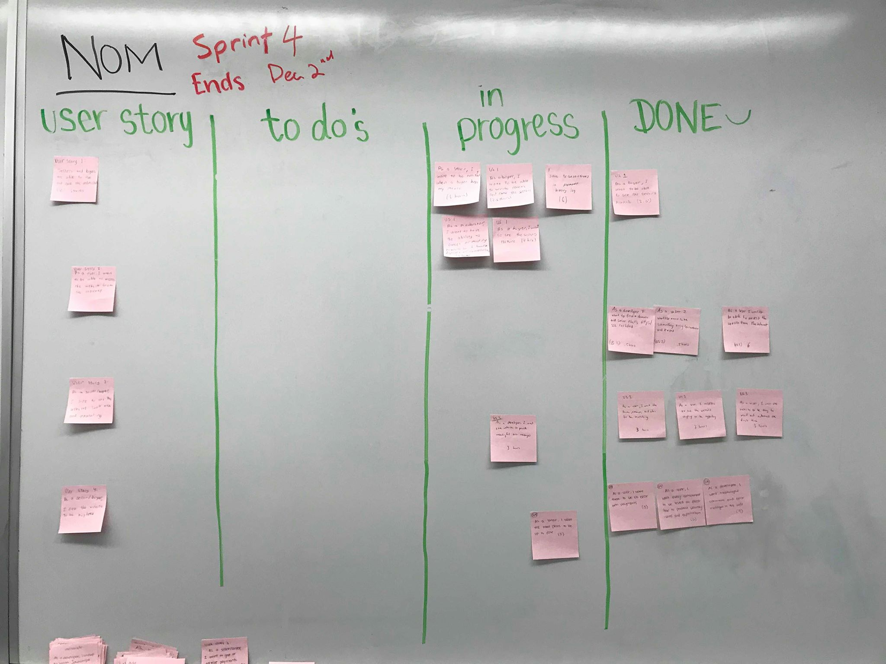
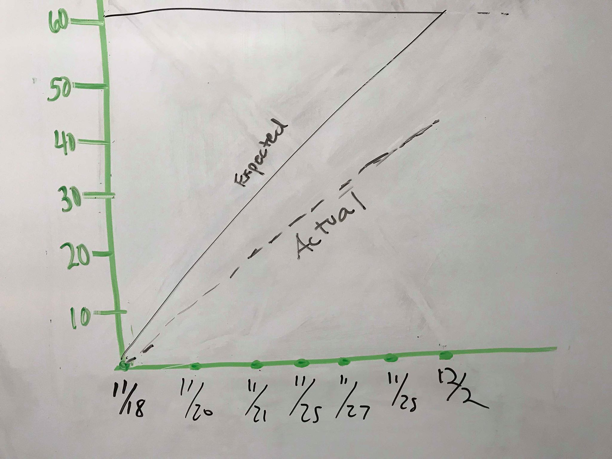
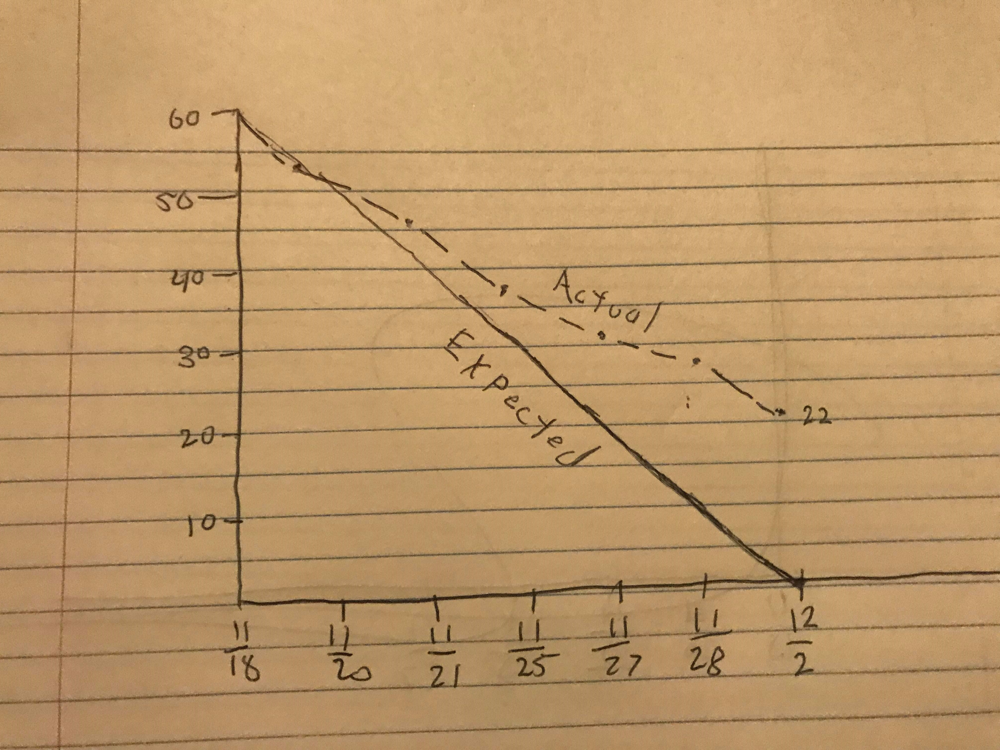

### ----- SPRINT 4 REPORT -----

**Product Name:** NOM Dining Hall Meal Exchange

**Team Name:** Nom Slugs

**Sprint Completion Date:** December 2, 2018

### ----- ACTIONS TO STOP DOING -----

We overestimated the number of tasks we can complete in one sprint, and need to stop skipping over time for individual features in sprint planning meeting. We should stop underestimating these tasks. 

### ----- ACTIONS TO START DOING -----

We should have more upfront architecture. We need to discuss more before starting code. We should discuss challenges and ask for help when needed. We should spend more time estimating tasks and distributing tasks to specific people.

### ----- ACTIONS TO KEEP DOING -----

We should keep the meeting times the same. We should keep showing up on time and communicate outside of meetings even more. Communicate more like we did in sprint 4. 

### ----- WORK COMPLETED / NOT COMPLETED -----

**Incomplete:** User Story 1: Writing Reviews, moderating payments, email notification when someone buys, profile picture, payment history 
Most of the features in User Story 1 are incomplete. However, many are close to completion.

**Completed:** User Story 2: Able to access the NOM website on Internet

**Incomplete:** User Story 3: Website styling
Website is does not look like a professional website, but we definitely made improvements from previous sprints.

**Incomplete:** User Story 4: Website bugs
Website has many small bugs. We removed a lot of issues in sprint 4, and if we did a sprint 5 we could remove almost all the bugs.

### ----- WORK COMPLETION RATE -----

**Total User Stories Completed:** 1/4
**Total Hours Completed:** 40/61.5
**Total Days:** 14 days, 6 scrums

