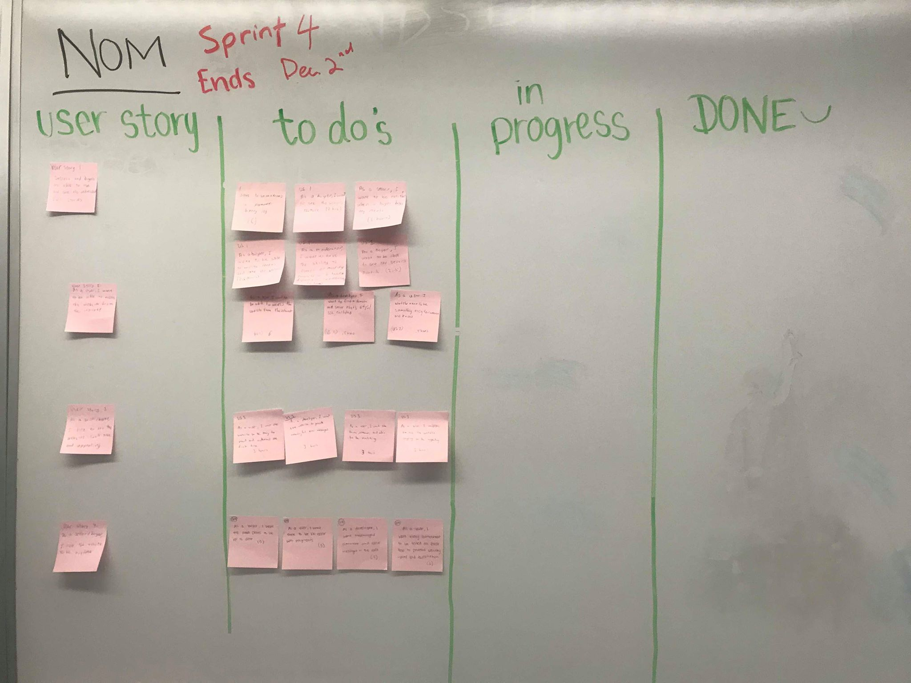

# ----- SPRINT 4 PLAN -----
**Product Name:** NOM Dining Hall Meal Exchange  
**Team Name:** Nom Slugs  
**Sprint Completion Date:** December 2, 2018  
**Revision Number:** 2   
**Revision Date:** November 30, 2018

## ----- GOAL -----
The goal is to finish important work and user stories from previous Sprints. In addition, we will make our website look more appealing and bug free.

## ----- TASK LISTING -----
### User Story 1: As a user I want to have features from previous sprints that were incomplete in the final product.
  - As a buyer, I want to be able to see the seller’s profile (4 hours)
  - As a moderator, I want to have the ability to cancel or modify payouts so I can handle disputes or cancellations (4 hours)
  - As a buyer, I want to be able to write reviews and rate the sellers (2.5 hours)
  - As a seller, I want to be notified when a buyer buys my meals (6 hours)
  - As a buyer, I want to see the seller’s picture (4 hours)
  - As a user, I want to see transaction/payment history (6 hours)

**Total for User Story 1:** 26.5 hours

### User Story 2: As a user, I want to be able to access the website from the internet.
  - Get domain and get website to run properly on the url (6 hours)
  - As a developer, I want to find a domain and server for the website that’s HTTPS/SSL certified (0.5 hours)
  - As a user, I want the name to be something easy to remember and know (0.5 hours)

**Total for User Story 2:** 7 hours

### User Story 3: As a seller/buyer, I want the website to look appealing.
  - As a user, I want the website style to be appealing (3 hours)
  - As a user, I want the fonts, themes, and colors to be matching (3 hours)
  - As a user, I want the website to be easy to read and understand the first time (3 hours)
  - As a developer, I want the website to provide meaningful error messages (3 hours)

**Total for User Story 3:** 12 hours

### User Story 4:** As a seller/buyer, I would like the website to be bug free.

 - As a user, I want there to be no error with payment (3 hours)
 - As a buyer, I want the meal plans to be up to date (3 hours)
 - As a user, I want every component to be tested and error free to prevent security issues and exploitation (6 hours) 
 - As a developer, I want meaningful comments and error messages in the code (4 hour)

 **Total for User Story 4:** 16 hours
 
 **TOTAL HOURS: 61.5**
 
## ----- TEAM ROLES -----
**Megan Wu:**       Product Owner, Developer  
**Nicolle Ayon:**   Developer   
**Eric Rong:**      Scrum Master, Developer  
**Steve Chan:**     Scrum Master, Developer  
**Kyler Beck:**     Developer  

## --- INITIAL TASK ASSIGNMENT -----
**Megan Wu:**  
  User story 2: tasks 1,2,3
**Nicolle Ayon:**  
  User Story 3: tasks 1,2,3
**Eric Rong:**  
  User Story 1: tasks 3,7
**Steve Chan:**  
  User story 1: tasks 3,7
**Kyler Beck:**  
  User story 3: tasks 1,2,3

## --- INITIAL SCRUM BOARD -----
     

## ----- SCRUM TIMES -----
**Sunday**    2:00 pm  
**Tuesday**   6:30 pm  
**Wednesday** 2:00 pm (TA meeting: Dylan)  

